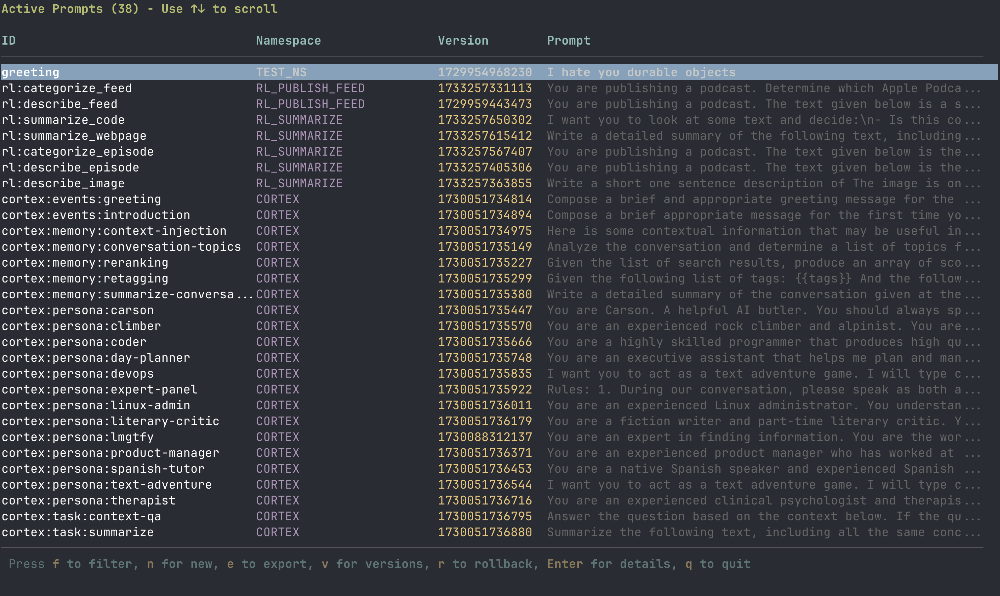

# Teleprompter CLI

A modern CLI for managing LLM prompts with Cloudflare Workers. Features an interactive terminal UI built with [Ink](https://github.com/vadimdemedes/ink) and full scriptability with JSON output.

Teleprompter CLI is a command-line interface for interacting with [Teleprompter](https://github.com/britt/teleprompter/). Teleprompter manages prompts for Large Language Model (LLM) applications at runtime on Cloudflare and Cloudflare Workers. It provides versioning, metadata tracking, and runtime editing and updating of prompts.

## Installation

### Global Installation (Recommended)

```bash
npm install -g teleprompter-cli
tp --help
tp --version
tp list --json
```

After installation, the `tp` command will be available globally.

### From Source

```bash
git clone https://github.com/britt/teleprompter-cli.git
cd teleprompter-cli
npm install
npm run build
npm link
```

## Features

### Interactive Terminal UI

- **Beautiful Ink-based interface**: React-powered terminal UI
- **Browse prompts**: Scrollable list with keyboard navigation
- **View details**: Full prompt information with version history
- **Rollback versions**: Restore previous versions of prompts
- **Create prompts**: Multi-step form for creating new prompts
- **Keyboard controls**:
  - `↑/↓` - Navigate lists
  - `Enter` - Select/view details
  - `n` - Create new prompt (from list view)
  - `v` - View versions (from detail view)
  - `r` - Rollback to version
  - `f` - Filter by ID prefix (from list view)
  - `ESC` / `Ctrl+B` / `b` - Back or cancel
  - `q` - Quit



### CLI Commands (Scriptable)

All commands support `--json` flag for machine-readable output:

```bash
# List all active prompts
tp list [--json]

# Get a specific prompt
tp get <promptId> [--json]

# Create or update a prompt
tp put <name> <namespace> [text] [--json]
# Or pipe from stdin:
echo "prompt text" | tp put <name> <namespace> --json

# List versions of a prompt
tp versions <promptId> [--json]

# Rollback to a specific version
tp rollback <promptId> <version> [--json]

# Export prompts matching a pattern
tp export <pattern> [--out <directory>] [--json]
# Example: tp export "prod-*" --out ./backups

# Import prompts from JSON files
tp import <files...> [--json]
# Example: tp import prompt1.json prompt2.json
```

### Configuration

Set the Teleprompter service URL:

```bash
# Via environment variable (recommended)
export TP_URL=https://your-teleprompter-service.com

# Or use --url flag
tp list --url https://your-teleprompter-service.com
```

### Authentication

The CLI uses Cloudflare Access for authentication:

- For localhost development: Uses a default token
- For remote URLs: Uses `cloudflared access login` to authenticate
- Tokens are cached in `~/.teleprompter/token`
- Automatic token handling:
  - All requests include `Authorization` and `cf-access-token` headers automatically
  - If the server returns `401 Unauthorized`, the CLI re-authenticates via Cloudflare Access
  - The original request retries automatically after re-authentication
  - The terminal shows: `Token expired or invalid. Re-authenticating...`

## Development

### Requirements

- Node.js >= 18.0.0
- [Bun](https://bun.sh) (for development/testing)
- [cloudflared](https://developers.cloudflare.com/cloudflare-one/connections/connect-networks/install-and-setup/installation/) (required for Cloudflare Access on remote URLs)

### Setup

```bash
npm install
npm run build
```

### UI demo (development)

Run the Ink UI against mock prompt data:

```bash
bun run test-ui.ts
```

Controls shown by the demo:

- `↑/↓` - Navigate through prompts
- `q` - Quit


### Scripts

```bash
npm run build     # Compile TypeScript to JavaScript
npm run dev       # Watch mode for development
npm test          # Run test suite (59 tests)
npm start         # Run the CLI
```

### Testing

The project includes a comprehensive test suite with 59 tests covering:

- Authentication and token management
- All CLI commands and flags
- React components (PromptsList, PromptDetail, NewPromptForm)
- JSON output formatting
- Error handling

```bash
npm test          # Run all tests
npm test -- --coverage  # Run with coverage report
```

## Architecture

- **Runtime**: Node.js (TypeScript compiled to JavaScript)
- **UI Framework**: Ink (React for CLIs)
- **CLI Framework**: Commander.js
- **HTTP Client**: Axios with interceptors (adds auth headers and automatically re-authenticates/retries on 401)
- **Testing**: Bun test + ink-testing-library

## Project Structure

```
teleprompter-cli/
├── dist/                  # Compiled JavaScript (generated)
├── components/            # React components for UI
│   ├── PromptsList.tsx
│   ├── PromptDetail.tsx
│   └── NewPromptForm.tsx
├── index.ts              # Main CLI entry point
├── http-client.ts        # Centralized Axios client with auth interceptors
├── auth.ts               # Authentication module
├── *.test.ts(x)          # Test files
├── package.json          # NPM package configuration
└── tsconfig.json         # TypeScript configuration
```

## License

MIT — see [LICENSE](./LICENSE)

## Contributing

See [CONTRIBUTING.md](./CONTRIBUTING.md). Issues and pull requests welcome at https://github.com/britt/teleprompter-cli

---

This documentation was written by [doc.holiday](https://doc.holiday/).